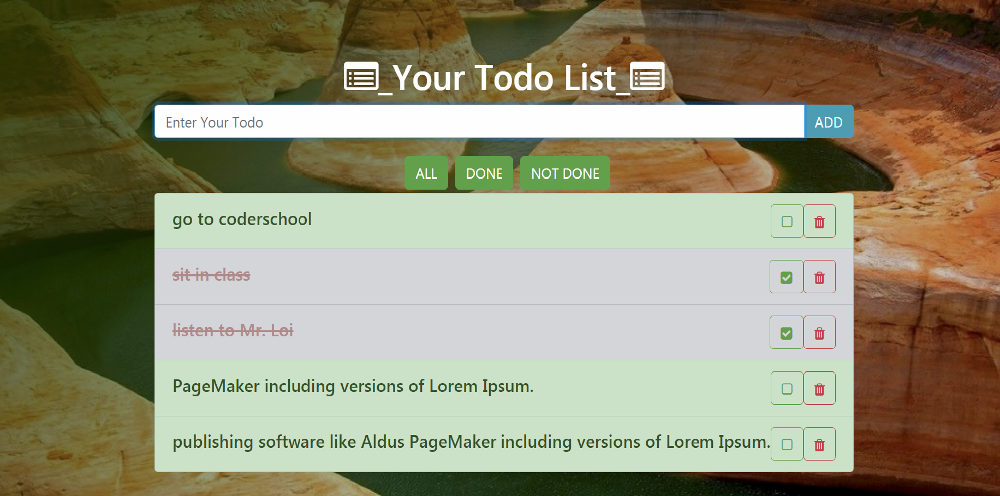

# CoderSchool FTW - _ A Todo App _

Created with love by: An-Khuong Huynh

This is a simple todo app that requires a solid understanding of the principles of JavaScript programming to customize.

<!-- ## Video Walkthrough -->

Here's a walkthrough of implemented user stories.

<!-- ## Code Reviews -->

<!-- This code was reviewed by @username and @otherusername.

- [Link to PR #X](https://github.com/vanmitG/canvas_game_starter/pull/1) - reviewed by @username.
- [Link to PR #Y](#) - reviewed by @otherusername. -->

## Required User Stories

<!-- - [ ] I have at least three code reviews from others. -->

- [x] The user can add todo by enter text into input box and either click ADD or Enter key
- [x] The Use can remove todo items
- [x] The user can toggle between Done or Not Done on todo items
- [x] The todo items is stored in local storage for future uses
- [x] The user can filter todo items by Done, Not Done or All by click on appropriate button

<!-- ## Optional User Stories

The following **additional** features are implemented:

- [x] List anything else that you can get done to improve the page!

## Time Spent and Lessons Learned

Time spent: **X** hours spent in total.

Describe any challenges encountered while building the app. -->

## License

    Copyright [yyyy] [name of copyright owner]

    Licensed under the Apache License, Version 2.0 (the "License");
    you may not use this file except in compliance with the License.
    You may obtain a copy of the License at

        http://www.apache.org/licenses/LICENSE-2.0

    Unless required by applicable law or agreed to in writing, software
    distributed under the License is distributed on an "AS IS" BASIS,
    WITHOUT WARRANTIES OR CONDITIONS OF ANY KIND, either express or implied.
    See the License for the specific language governing permissions and
    limitations under the License.
